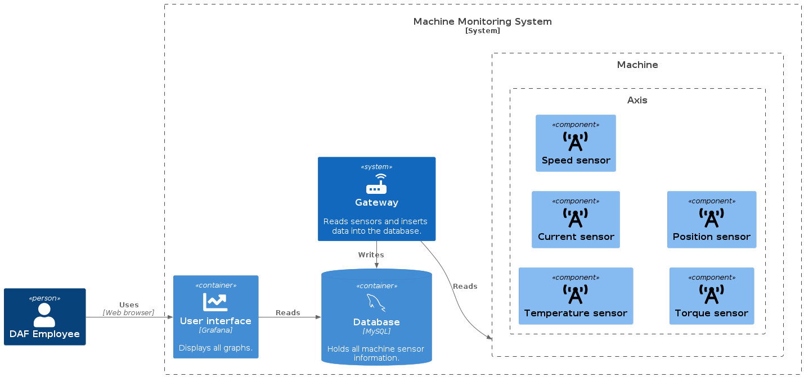

# DAF Maintenance Prediction

> For new people to the project, please refer to the transferability document in the docs folder -
> [docs/transferability-document.pdf](docs/transferability-document.md).

## Context

For the Maintenance department within the Engine Factory at _DAF_ it is valuable to be able to
execute condition-based maintenance activities instead of corrective or time-based maintenance
activities. The preferred method to achieve this is to log and analyze live and historical machine
data.

_DAF_ has currently set up a solution where the data of a couple of machines is saved in a _MySQL_
database and the data is analyzed in _Grafana_. With this solution, the wear of parts can be
monitored and anomalies can be detected. By monitoring the data and setting triggers, the
replacement of parts can be scheduled before the parts fail, which results in a significant cost
reduction.

### Diagram



## Goal

The current solution lacks some requirements (e.g. **scalability**, **load time** and **usability**) and therefore, an improved
solution can be developed.

## Received data

### Folder structure

The data used for this project was provided by DAF. The file received was `db_export_2022_12_01_2023_01_31.7z` and the structure looks like this:

```
├── 01 First 2 weeks of December
│   ├── bfc_alarms.sql
│   ├── DATASET_A11_Axis_A1_Axis.sql
│   ├── DATASET_A2_Axis_Z_Axis.sql
│   ├── DATASET_C_Axis_B_Axis.sql
│   ├── DATASET_MachineStatus.sql
│   ├── DATASET_PartProgramData.sql
│   ├── DATASET_W_Axis_Q1_Axis.sql
│   └── DATASET_X_Axis_Y_Axis.sql
├── 02 Rest of December
│   └── ...
├── 03 January
│   └── ...
├── bfcdatabase.sql
└── bfc_sources.sql

3 directories, 26 files
```

### Table relationships

**All tables** in the database are related to table `bfc_sources` which has `ID` column.
Each `ID` represents a machine/source of data in the engine factory. All tables are
related to `bfc_sources` with `BFC_SOURCE_ID` foreign key.


> For the whole picture, please refer to the ER diagram in the docs folder -
> `docs/diagrams/er-diagram.svg`.

## Starting development

### Running containers

To run _MySQL_ and _Grafana_:

```sh
docker compose up
```

Go to http://localhost:3000/ and use credentials `admin` both for username and password.

> Since _MySQL_ is used, we recommend downloading
> [_MySQL Workbench_](https://dev.mysql.com/downloads/workbench/) for development.

### Creating database

To create the database (execute `bfc_database.sql` and `bfc_sources.sql`):

> Note: For windows, you have to use Git Bash or WSL

```sh
./script/init-database.sh <path to folder with init scripts>

# For example,
# ./script/init-database.sh /home/user/Downloads/db_export_2022_12_01_2023_01_31

# For Windows
# ./script/insert-data.sh "C:\Users\user\Downloads\db_export_2022_12_01_2023_01_31"
```

### Inserting data

To insert data (execute `bfc_alarms.sql` and all `DATASET_*.sql`)`:

> Note: For windows, you have to use Git Bash or WSL

```sh
./script/insert-data.sh <path to folder with data scripts>

# For example (please note the quotes),
# ./script/insert-data.sh "/home/user/Downloads/db_export_2022_12_01_2023_01_31/01 First 2 weeks of December"

# For windows
# ./script/insert-data.sh "C:\Users\user\Downloads\db_export_2022_12_01_2023_01_31\01 First 2 weeks of December"
```

Execution takes around **15 minutes**.
