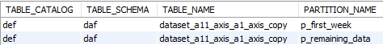
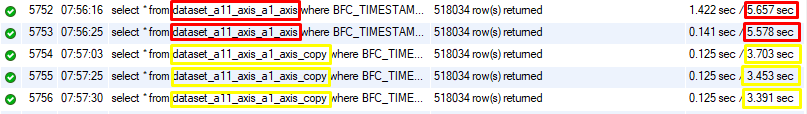

# Database Partitioning (or sharding)

## Introduction

Database partitioning is a common tractic in database management, employed with the aim of breaking down large databases and tables into more digestible fragments known as partitions. By doing so, the fundamental objective of partitioning is to effectively enhance the overall performance, scalability, and maintainability of databases. This report contains information about database partitioning, exploring its advantages and showcasing its significance in the field of database management.

## Benefits of Database Partitioning

1. **Improved Performance**: Database partitioning enables parallel processing of queries by distributing data across multiple partitions. This parallelism leads to faster query execution times, resulting in enhanced overall system performance.

2. **Scalability**: Partitioning facilitates horizontal scalability, allowing for the addition or removal of partitions as the database size expands or contracts. This flexibility ensures efficient resource utilization and accommodates increasing workloads.

3. **Ease of Maintenance**: Partitioning simplifies the management of large databases. It allows for efficient data archiving, backup, and recovery operations on individual partitions, reducing the maintenance overhead and streamlining administrative tasks.

4. **Data Isolation**: Partitioning provides logical and physical separation of data, which makes it easier to manage and secure sensitive information. By implementing fine-grained access control, partitioning minimizes the impact of failures or corruptions on the entire database.

## Types of Database Partitioning

1. **Horizontal Partitioning**: This technique involves dividing rows of a table into multiple partitions based on a specific condition or range of values. Each partition contains a subset of rows that satisfy the partitioning criteria. For instance, a sales table can be horizontally partitioned based on the sales region, allowing for efficient data retrieval and analysis.

2. **Vertical Partitioning**: In vertical partitioning, a table is divided into multiple partitions based on columns rather than rows. Each partition may store different sets of columns, which optimizes query performance by reducing the amount of data read from storage. Vertical partitioning is particularly useful when certain columns are accessed more frequently than others, improving data retrieval efficiency.

3. **List Partitioning**: List partitioning assigns rows to partitions based on specific values from a predefined list. It allows for explicit control over which partition a row belongs to. For example, a customer table can be list partitioned based on customer types, facilitating targeted analysis and management.

4. **Range Partitioning**: Range partitioning distributes rows to partitions based on a range of values. Each partition represents a specific range, such as date ranges or numeric intervals. Range partitioning is effective for tables with a natural ordering based on a specific column, such as a timestamp or an ID, enabling efficient data retrieval and analysis.

5. **Hash Partitioning**: Hash partitioning evenly distributes rows across partitions using a hash function. This method ensures a random distribution of data, which can optimize workload balancing and evenly distribute I/O load across storage devices.

## EXAMPLE: MySQL Range Partitioning

The purpose of range partitioning the tables is to improve query performance and manage data more efficiently. By dividing the data based on the BFC_TIMESTAMP column, we can distribute the records into separate partitions corresponding to different years. This partitioning scheme allows for quicker access to data within a specific time range and can enhance query execution times for queries that involve filtering or aggregating data based on the BFC_TIMESTAMP column.

To implement range partitioning in MySQL, we can make use of the PARTITION BY RANGE clause. In this case, we would use the BFC_TIMESTAMP column as the partitioning key and define the partition ranges based on the day. Each partition will hold the records that fall within the specified day range (1 week).

For example, to partition the dataset_a11_axis_a1_axis table by year, we would create the partitions using the PARTITION BY RANGE clause and define the partition ranges accordingly. The exact syntax may vary based on the specific version of MySQL being used, but the general structure would be as follows:

**Example:**

```sql

ALTER TABLE dataset_a11_axis_a1_axis_copy
PARTITION BY RANGE (TO_DAYS(BFC_TIMESTAMP)) (
	PARTITION p_first_week VALUES LESS THAN (TO_DAYS('2022-12-08')),
	PARTITION p_remaining_data VALUES LESS THAN MAXVALUE
);

```

In the above example, the table is partitioned into separate partitions based on the day of the BFC_TIMESTAMP column. Each partition is named representing the respective range. The VALUES LESS THAN clause determines the upper bound of each partition, ensuring that records are distributed correctly based on their BFC_TIMESTAMP values.

By implementing range partitioning, the database system can improve query performance when retrieving data from the dataset_a11_axis_a1_axis table, especialy when the queries involve filtering or aggregating data based on the day. Additionally, range partitioning can aid in managing the storage of large datasets by distributing the data across different partitions, which can enhance overall database performance and maintenance. For example, if you need to delete or archive old data, you can target specific partitions instead of scanning the entire dataset.

Searching for records of the partitions after creating them can be done with the following query:

```sql

SELECT *
FROM information_schema.PARTITIONS
WHERE TABLE_SCHEMA = 'daf'
  AND TABLE_NAME = 'dataset_a11_axis_a1_axis_copy';

```



Querying a partitioned table, can be treated like querrying any other table without the need to explicitly specify partitions.

```sql

SELECT *
FROM `dataset_a11_axis_a1_axis`
WHERE `BFC_TIMESTAMP` >= '2022-01-01'
  AND `BFC_TIMESTAMP` < '2023-01-01';

```

**Test:**

```sql

select * from dataset_a11_axis_a1_axis
where BFC_TIMESTAMP >= '2022-12-02' and BFC_TIMESTAMP <= '2022-12-03';

select * from dataset_a11_axis_a1_axis_copy
where BFC_TIMESTAMP >= '2022-12-02' and BFC_TIMESTAMP <= '2022-12-03';

```

For testing purposes, I created a copy of the `dataset_a11_axis_a1_axis` table and populate it with the same data. Then I partitioned only the copy table and queried them both for the same subset of the data that coresponds to one day.

**Results:**


The test results show that the partitioned table has an easier time querying through the dataset because it only has to identify the correct partition and search through only that subset of the data.

**MySQL doesn't support foreign keys with partitioning this means that in order to create partitionning tables the foreign key constraint on the main table has to ne removed and instead requires that maybe other tactics be implemented to create the dependency.**

## Considerations for Database Partitioning

1. **Data Distribution**: Analyzing data distribution patterns is crucial for determining the most suitable partitioning strategy. Factors like access patterns, query performance, and the distribution of data values should be considered to ensure optimal partitioning.
2. **Partitioning Key**: Selecting an appropriate partitioning key aligned with the query workload is essential. The partitioning key should evenly distribute data across partitions and facilitate efficient data retrieval.
3. **Partition Size**: Striking a balance between partition size and query performance is important. Partitions that are too small can lead to excessive overhead, while overly large partitions may negatively impact query performance.
4. **Partitioning Overhead**: It's essential to consider the overhead associated with managing partitions. Additional resources, such as storage space, processing power, and administrative effort, may be required for successful partitioning.
5. **Data Skew**: Being mindful of data skew is critical to prevent certain partitions from becoming significantly larger or receiving a higher workload than others. Skewed data distribution can lead to performance issues and may necessitate data rebalancing.

## Conclusion

In conclusion, database partitioning is a great technique for improving the performance, scalability, and maintainability of large and slow databases. By dividing data into smaller partitions, parallel processing is enabled, simplifying management tasks and enhancing overall system efficiency. Understanding the various partitioning techniques and carefully considering the key factors during the partitioning process are crucial for achieving optimal results.

## References

1. Medic, M. (2020). [Database table partitioning in SQL Server](https://www.sqlshack.com/database-table-partitioning-sql-server/). SQL Shack - Articles About Database Auditing, Server Performance, Data Recovery, and More.

2. RANGE Partitioning Type. MariaDB KnowledgeBase. [RANGE Partitioning](https://mariadb.com/kb/en/range-partitioning-type/)

3. MySQL :: MySQL 8.0 Reference Manual :: 24.4 [Partition Pruning.](https://dev.mysql.com/doc/refman/8.0/en/partitioning-pruning.html)

4. Naveen, & Naveen. (2023). [Database Partitioning Techniques](https://intellipaat.com/blog/database-partitioning-techniques/?US). Intellipaat Blog.

5. Custer, C. (2023, February 7). What is data partitioning, and how to do it right. Cockroach Labs. [https://www.cockroachlabs.com/blog/what-is-data-partitioning-and-how-to-do-it-right/](https://www.cockroachlabs.com/blog/what-is-data-partitioning-and-how-to-do-it-right/)

6. How to handle foreign key while partitioning. (n.d.). Stack Overflow. [Foreign key while partitioning](https://stackoverflow.com/questions/1537219/how-to-handle-foreign-key-while-partitioning)
