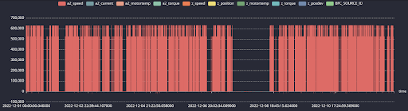

# Database Alternatives

This document covers the benefits and steps of migrating the current structure of the MySQL database into timeseries database.


## InfluxDB

Pros
- higher performance with timeseries data
- low storage costs
- quick query of a data
- build in timeseries functions
- scalability 

Cons
- Does not work with MySQL and it's hard to migrate data
- Less support as it is newer database

There are 3 options to load data into the InfluxDB "buckets"
### Upload by CSV
This is the first 3 rows of a csv file as an example:
```
"BFC_SOURCE_ID","BFC_TIMESTAMP","DATAPOINT_A2_Speed","DATAPOINT_A2_Position","DATAPOINT_A2_Current","DATAPOINT_A2_MotorTemp","DATAPOINT_A2_Torque","DATAPOINT_Z_Speed","DATAPOINT_Z_Position","DATAPOINT_Z_Current","DATAPOINT_Z_MotorTemp","DATAPOINT_Z_Torque","DATAPOINT_Z_PosDev","DATAPOINT_A2_PosDev","DATAPOINT_Z_Lag","DATAPOINT_Z_ControlDev","DATAPOINT_Z_ContourDev"

"3","2022-12-01 00:00:00.046000","2.5749","274.848","0.0558","27.5","0.044","0.293","0","-0.2854","24.1999","-0.386","0.0274","0",NULL,NULL,NULL
"3","2022-12-01 00:00:00.589000","0","274.848","0.0558","27.5","0.046","-0.293","0","-0.2878","24.1999","-0.392","0.0274","0",NULL,NULL,NULL

```
The top part is the headers (the columns in the tables) and the bottom is the rows with data.

The data from the MySQL tables can be exported into csv files and import on InfluxDB through the cloud. Trying to directly import the csv file without modifying it results to this error (as for every other table):

```
error calling function "from" @2:11-2:28: must provide csv raw text or filename
```
Also, by uploading through the cloud is not a good idea in general, as the csv files are with size of 1gb or more and it may result to more connection problems. Using the Influx CLI, the csv files can be imported locally through the terminal.
### Influx CLI
To write a file to bucket
```
influx write --bucket daf --file "C:\Semester 6\daf2.csv" -precision ms
```
where
- --bucket daf indicates the database
- -precision ms indicates the timestamp precision (s - seconds, ms - miliseconds, us - microseconds, ns - nanoseconds)

The code above results to this error:
```
column '_time': parsing time "2022-12-01 00:05:35.069000" as "2006-01-02T15:04:05Z07:00": cannot parse " 00:05:35.069000" as "T"
```
The format of the timestamp in the data is 2022-12-01 00:00:00.046000, and it should be 2022-12-01T00:00:00.04Z6000. To fix that there are only two options:
- Use Flux to transform the data after import (import the timestamp as a string, then convert it with Flux)
- Preprocess the csv file using python script

The script below fixes the timestamp format:
```python
from datetime import datetime
import influxdb_client, os, time
from influxdb_client import InfluxDBClient, Point, WritePrecision
from influxdb_client.client.write_api import SYNCHRONOUS
import csv

# InfluxDB environment credentials
token = "yffucGPRYgFfDlC0ZQUeSh8am4sZ-9B8LcG8o4fwXe9QOfzxrvsBYKq4Aar6R8o8iJOGwBls7MnFvUcSGznG5A=="
org = "Bulgarski Software 1"
url = "https://eu-central-1-1.aws.cloud2.influxdata.com"
bucket = "daff"

client = InfluxDBClient(url=url, token=token)
write_api = client.write_api(write_options=SYNCHRONOUS)

# Open the CSV file
with open('./data.csv', 'r') as file:
    reader = csv.reader(file)
    header = next(reader)

    # Iterate over each row in the CSV
    for row in reader:
        # Create a new Point
        point = Point("BFC_SOURCE_ID")

        # Convert the timestamp to Unix timestamp format
        timestamp_str = row[header.index('BFC_TIMESTAMP')].strip('"')
        dt = datetime.strptime(timestamp_str, "%Y-%m-%d %H:%M:%S.%f")
        timestamp_ns = int(dt.timestamp() * 1e9)

        # Set the timestamp
        point.time(timestamp_ns, WritePrecision.NS)

        # Set the rest of the fields
        for i, item in enumerate(row):
            if i != header.index('BFC_TIMESTAMP'):
                # Check if the item is 'NULL'
                if item == 'NULL':
                    point.field(header[i], None)
                else:
                    point.field(header[i], float(item))

        # Write the point to InfluxDB
        write_api.write(bucket, org, point)
```

Both solutions are not efficient as they take a lot of time and effort to convert the data. First, every table must be converted to csv files. Proper annotations and headers must be set and the timestamp format must be updated for every file. In addition, existing SQL queries must be converted to InfluxQL in order to query data and the gateway configuration must be updated to feed the InfluxDB database. 

## QuestDB
QuestDB is an open-source, NewSQL database that was designed specifically for real-time analytics on time series data. It was developed with a focus on speed, reliability, and ease of use.

    - SQL Support: QuestDB supports full SQL including joins. This is in contrast to InfluxDB, which uses a specialized query language called InfluxQL.

    - Speed: QuestDB uses a columnar storage model and a novel indexing algorithm called designated timestamp which enables faster data ingestion and querying. 

    - Efficiency: QuestDB was designed to have a low memory and CPU footprint, reducing the total cost of ownership. It has an efficient storage model and it compresses the data very effectively.

### Import data
To migrate the data from MySQL to QuestDB, there are two convenient ways:
 - Data Import to QuestDB: QuestDB supports importing data in CSV format. For this migration, we used the REST API, posting CSV data directly to QuestDB. Alternatively, the Web Console's "Import" button could be used for uploading CSV files.

- Schema Migration: To recreate the schema (tables and relationships) in QuestDB, the existing MySQL table creation scripts were used with minor modifications, given that QuestDB fully supports SQL.

The screenshots below demonstrate the results of the migration. The query gets the data from 9 sensors, 2 axis and 2 machines for 2 million rows (~ 12 days)



It excecutes in 3.42 seconds, which is slightly faster than the MySQL setup.


## Conclusion

QuestDB has been selected as the most suitable database alternative for based on the project requirements. This decision was informed by several factors:

    - SQL Support: The support for full SQL including joins provided by QuestDB ensures compatibility with our existing setup and simplifies the migration process. It allows us to leverage SQL's expressiveness and versatility in defining complex queries and maintaining data relationships.

    - Performance: QuestDB's columnar storage model and innovative indexing algorithm, specifically designed for time series data, promise high speed in data ingestion and querying. This will be beneficial for real-time analytics needs.

    - Efficiency: The efficient data storage and compression by QuestDB reduces the total cost of ownership by requiring fewer resources in terms of memory and CPU usage.

    - Ease of Migration: The migration from MySQL to QuestDB is relatively straightforward, thanks to the SQL support by QuestDB. As we've shown in the previous section, this process is efficient and ensures data integrity and consistency.

It's important to mention that while InfluxDB has a more established ecosystem, the advantages of QuestDB in terms of SQL support, performance, and efficiency outweighed the benefits of InfluxDB for our specific use case. Hence, QuestDB is the chosen solution to improve visualization usability for the project.

