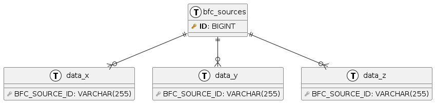
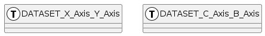
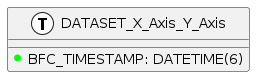
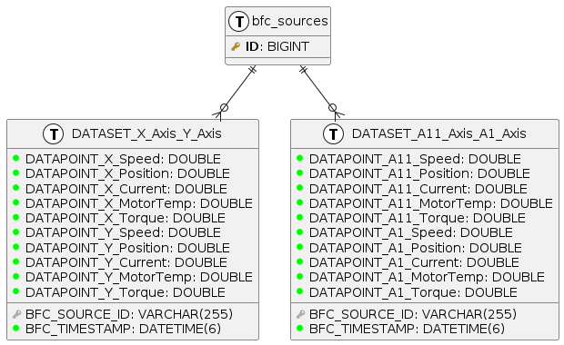

# Grafana usability research

## Introduction

### Context

For the Maintenance department within the Engine Factory at _DAF_ it is valuable to be able to
execute condition-based maintenance activities instead of corrective or time-based maintenance
activities. The preferred method to achieve this is to log and analyze live and historical machine
data.

_DAF_ has currently set up a solution where the data of a couple of machines is saved in a _MySQL_
database and the data is analyzed in _Grafana_. With this solution, the wear of parts can be
monitored and anomalies can be detected. By monitoring the data and setting triggers, the
replacement of parts can be scheduled before the parts fail, which results in a significant cost
reduction.

The current solution at _DAF_ lacks some requirements, one of which is **usability**.

### Research question and objectives

> How can visualization usability be improved for the Maintenance department within the Engine
> factory?

The goal of this research is to **research the data provided by _DAF_** and **detect patterns that
can be leveraged to improve the usability of the visualizations**. These patters will then be used
to **implement queries that can be used in _Grafana_**.

### Functional requirements

- The machine data has to be visualized live with a maximum sampling rate of 0.2 Hz.
- Historical data has to be visualized for different time ranges (5 min, 1 hr, 12 hr, 1 day, 7 days,
  etc.) with a minimized load time - Long-history fast-refreshing-rate real time dashboards are not
  a use-case that is being considered – these two are mutually exclusive. - The same is true for
  frequently-checked triggers – The more often a trigger-query is issued, the smaller the time frame
  of the considered data.
- It has to be possible to visualize data of different machines and/or sensors in one graph
  (merged) with a minimized load time.
- It should be a reasonable task for a non-IT employee to generate simple graphs.

### Table of contents

**TODO**

## Identifying patterns

### Table relationships

**All tables** in the database are related to table `bfc_sources` which has `ID` column.
Each `ID` represents a machine/source of data in the engine factory. All tables are
related to `bfc_sources` with `BFC_SOURCE_ID` foreign key.



### Tables

Due to limitations from `Siemens Brownfield Connectivity Gateway` the data is stored in pairs of
two. `X Axis` with `Y Axis`, `C Axis` with `B Axis` and so on.



All axis datasets/tables are:

- `DATASET_X_Axis_Y_Axis`
- `DATASET_A11_Axis_A1_Axis`
- `DATASET_A2_Axis_Z_Axis`
- `DATASET_C_Axis_B_Axis`
- `DATASET_W_Axis_Q1_Axis`

By looking at the table names, for example `DATASET_X_Axis_Y_Axis`, a naming pattern for the table
names is observed: `DATASET_<axis>_Axis_<axis>_Axis`.

### Axes

Using all table names and the table naming pattern, we can derive the axis names:

- `X`
- `Y`
- `A11`
- `A1`
- `A2`
- `Z`
- `C`
- `B`
- `W`
- `Q1`

### Sensors

By looking at the column names, for example `DATAPOINT_X_Speed` or `DATAPOINT_Y_Position`, a column
naming pattern is observed: `DATAPOINT_<axis>_<sensor>`.

Using the pattern, we can derive the sensor names:

- `Speed`
- `Position`
- `Current`
- `MotorTemp`
- `Torque`

### Timestamps

Every table row has a timestamp column `BFC_TIMESTAMP`.



### Summary

To summarize, table names follow pattern `DATASET_<axis>_Axis_<axis>_Axis` and column names follow
`DATAPOINT_<axis>_<sensor>`.

This is a small sample from the database ER diagram that gathers everything above.



## Generalizing the queries

Grafana supports Variables that can
be used to make the queries more general. These variables can then be used in templates.

> A _template_ is any query that contains a variable.

Based on the information in the previous section we can make the following variables:

### Identifying variables

Based on the findings above, the following things can be considered variables:

- Machine
- Axis
- Sensor
- Table name (derived from axis and sensor)

### Machine

To make machines as variables, go to `Dashboard settings`, `Variables` and use this under
`Query`:

```sql
/*
Select all machine ids.
*/
SELECT
    BFC_CLIENT_ID as __text,
    ID as __value
FROM bfc_sources
WHERE BFC_APPLICATION_TYPE = "iotclient"
```

Preview: `3`, `316`, `373`, `5`, `6`

### Axis

To make axes as variables, go to `Dashboard settings`, `Variables` and use this under
`Query`:

```sql
/*
Select all table names that have two axis in the name and split axes names in two columns.
*/
SELECT
	REGEXP_REPLACE(TABLE_NAME, "DATASET_(.+)_Axis_(.+)_Axis", "$1"),
    REGEXP_REPLACE(TABLE_NAME, "DATASET_(.+)_Axis_(.+)_Axis", "$2")
FROM INFORMATION_SCHEMA.TABLES
WHERE TABLE_NAME REGEXP "DATASET_.+_Axis_.+_Axis"
```

Preview: `A11`, `A1`, `A2`, `C`, `W`, `X`, `Y`, `Z`, `Q1`, `B`

### Sensor

To make sensors as variables, go to `Dashboard settings`, `Variables` and use this under `Query`:

```sql
/*
Select all columns that have:
    - two axis in the table name.
    - two words in the column name.
*/
SELECT DISTINCT COLUMN_NAME
FROM INFORMATION_SCHEMA.COLUMNS
WHERE
    COLUMN_NAME REGEXP "DATAPOINT_.+_.+"
    AND TABLE_NAME REGEXP "DATASET_.+_Axis_.+_Axis"
```

Then under `Regex` use this:

```sh
# Extract the sensor name from the column name.
/DATAPOINT_.+_(.*)/
```

Preview: `Current`, `MotorTemp`, `Position`, `Speed`, `Torque`

## Visualizing the data

### 1 Axis - 1 Sensor

Querying for a single axis and sensor is straightforward:

```sql
/*
Select the average of the axis sensor for each machine based on a time interval.
*/
SELECT
    $__timeGroup(BFC_TIMESTAMP,$__interval) as time,
    AVG(DATAPOINT_${axes}_${sensors}),
    BFC_SOURCE_ID
FROM ${_table_name:raw}
WHERE
    BFC_SOURCE_ID IN ($machines)
    AND $__timeFilter(BFC_TIMESTAMP)
GROUP BY BFC_SOURCE_ID, time
ORDER BY time
```

> Note: It is assumed that `axes` and `sensors` do not have `Multi-line` enabled.

### 1 Axis - Multiple Sensors

Querying for single axis and multiple sensors proves to be more difficult. The problem arises from
the fact that sensors are stored in multiple columns. Say we want to query for `X` axis and `Speed`,
`Position`, `MotorTemp` and `Current` sensors:

```sql
SELECT
    $__timeGroup(BFC_TIMESTAMP,$__interval) as time,
    AVG(DATAPOINT_X_Speed),
    AVG(DATAPOINT_X_Position), -- repetitive
    AVG(DATAPOINT_X_MotorTemp), -- repetitive
    AVG(DATAPOINT_X_Current), -- repetitive
    BFC_SOURCE_ID
FROM DATASET_X_Axis_Y_Axis
WHERE
    BFC_SOURCE_ID IN ("3")
    AND $__timeFilter(BFC_TIMESTAMP)
GROUP BY BFC_SOURCE_ID, time
ORDER BY time
```

This obviously looks like a lot of repetition.

One solution is to use loops to generate the queries. For this we will also need to use procedures.

```sql
TODO: Add stored procedure from presentation demo
```

### Multiple Axes - 1 Sensor

```sql
DROP PROCEDURE IF EXISTS get_sensor_for_multiple_axes_multiple_machines; 
DELIMITER //
CREATE PROCEDURE get_sensor_for_multiple_axes_multiple_machines(
    IN axes JSON,
    IN sensor TEXT,
    IN machines TEXT,
    IN time_group TEXT,
    IN time_filter TEXT
)
BEGIN
    /* Declare variables for iterating over the provided axes. */
    DECLARE current_axis VARCHAR(255);
    DECLARE done INT DEFAULT FALSE;
    /*
    Transfrom provided axes to a one column with many rows.

    For example, if ["X", "C"] is provided as axes, the following statement will turn it over to
    
    */
    DECLARE cursor_i CURSOR FOR SELECT value FROM JSON_TABLE(axes, '$[*]' COLUMNS(
        value VARCHAR(255) PATH '$'
      )) AS jt;
    DECLARE CONTINUE HANDLER FOR NOT FOUND SET done = TRUE;
    OPEN cursor_i;

    SET @_query = CONCAT(
        "WITH sources AS (SELECT * FROM bfc_sources WHERE ID in (", machines, ")), "
    );
    SET @main_union = "";

    SET @already_iteared_over = "";

    read_axis_loop: LOOP
        FETCH cursor_i INTO current_axis;
        IF done THEN
        LEAVE read_axis_loop;
        END IF;

        /* If already iterated over this axis. */
        IF LOCATE(CONCAT("--", current_axis, "--"), @already_iteared_over) THEN
            /* Skip and go to the next one. */
            ITERATE read_axis_loop;
        END IF;

        /* Find table name for the current axis. */
        SET @axis_table_name := (
            SELECT TABLE_NAME
            FROM INFORMATION_SCHEMA.TABLES
            WHERE TABLE_NAME REGEXP CONCAT(current_axis, "_Axis")
        );

        /* Derive the twin axis name from the table name. */
        SET @twin_axis = REGEXP_REPLACE(@axis_table_name, "DATASET_(.+)_Axis_(.+)_Axis", "$1");
        IF @twin_axis = current_axis THEN
            SET @twin_axis = REGEXP_REPLACE(@axis_table_name, "DATASET_(.+)_Axis_(.+)_Axis", "$2");
        END IF;
        
        SET @sensor_values = CONCAT(
            "AVG(DATAPOINT_", current_axis ,"_", sensor, ") as ", current_axis, ", "
        );

        /* If twin axis is selected too, add it to the select statement */
        IF LOCATE(@twin_axis, axes) THEN
            SET @sensor_values = CONCAT(
                @sensor_values,
                "AVG(DATAPOINT_", @twin_axis ,"_", sensor, ") as ", @twin_axis, ", "
            );
            SET @already_iteared_over = CONCAT(
                @already_iteared_over,
                "--", @twin_axis, "--"
            );
        END IF;

        SET @_query = CONCAT(
            @_query,
            "table_", current_axis, @twin_axis, " AS (SELECT ",
            @sensor_values,
            time_group, ", "
            "sources.BFC_CLIENT_ID as machine ",
            "FROM ",
            @axis_table_name, " as data INNER JOIN sources on data.BFC_SOURCE_ID = sources.id ",
            "WHERE ",
            time_filter,
            " AND data.BFC_SOURCE_ID IN (", machines, ") ",
            "GROUP BY time, machine ",
            "ORDER BY time), "
        );
      
      
        SET @main_union = CONCAT(
            @main_union,
            "(SELECT time, '", current_axis, "' as 'As', machine, ", current_axis, " as __value FROM table_", current_axis, @twin_axis, ") ",
            "UNION ALL "
        );

        /* If twin axis is selected too, add it to the union statement. */
        IF LOCATE(@twin_axis, axes) THEN
            SET @main_union = CONCAT(
                @main_union,
                "(SELECT time, '", @twin_axis, "' as 'As', machine, ", @twin_axis, " as __value FROM table_", current_axis, @twin_axis, ") ",
                "UNION ALL "
            );
        END IF;

        SET @already_iteared_over = CONCAT(
            @already_iteared_over,
            "--", current_axis, "--"
        );

    /* Exit loop. */   
    END LOOP;

    /* Close cursor iterating over axes. */
    CLOSE cursor_i;

    /* Remove trailing ' UNION ALL  ' from main_union variable */
    SET @main_union = TRIM(TRAILING ' UNION ALL ' FROM @main_union); 
    
    /* Build the final query. */
    SET @_query = CONCAT(
        @_query,
        "MAIN_UNION AS ( ",
        @main_union,
        ") ",
        "SELECT * FROM MAIN_UNION ORDER BY time"
    );

    /* Execute the final query. */  
    PREPARE stmt FROM @_query;
    EXECUTE stmt;
    DEALLOCATE PREPARE stmt;

/* End stored procedure. */
END //

/* Set delimeter back to default ';'. */
DELIMITER ;

```

To call the procedure in Grafana:

```sql
CALL get_sensor_for_multiple_axes_multiple_machines(
  '${axis:json}',
  "${sensors:raw}",
  "${machines:csv}",
  "$__timeGroup(data.BFC_TIMESTAMP,$__interval) as time",
  "$__timeFilter(data.BFC_TIMESTAMP)"
);
```


TODO:
- Update the query to 


## References

- [Grafana Templates](https://grafana.com/docs/grafana/latest/dashboards/variables/#templates)

- [Grafana Variables](https://grafana.com/docs/grafana/latest/dashboards/variables/)

- [Grafana Variable Syntax](https://grafana.com/docs/grafana/latest/dashboards/variables/variable-syntax/)

- [Grafana Add and Manage Variables](https://grafana.com/docs/grafana/latest/dashboards/variables/add-template-variables/#__interval)

- [Grafana MySQL Datasource](https://grafana.com/docs/grafana/latest/datasources/mysql/)

- [Grafana MySQL Datasource Query Variables](https://grafana.com/docs/grafana/latest/datasources/mysql/#query-variable)

- [Grafana Advanced Variable Format Options CSV](https://grafana.com/docs/grafana/latest/dashboards/variables/variable-syntax/#csv)

https://grafana.com/docs/grafana/latest/dashboards/variables/add-template-variables/#multi-value-variables

https://stackoverflow.com/questions/5125096/for-loop-example-in-mysql

https://www.mysqltutorial.org/stored-procedures-loop.aspx

https://sebhastian.com/mysql-split-string/

https://github.com/grafana/grafana/issues/8755#issuecomment-384600623

https://www.timescale.com/blog/grafana-variables-101/

https://community.grafana.com/t/using-variables-to-dynamically-select-columns-in-mysql/17499

https://engineering.fb.com/2022/04/26/developer-tools/sql-notebooks/

# JUPYTER SQL NOTEBOOKS

```sql
CALL test('${machines:json}')
```

```sql
DELIMITER //

DROP PROCEDURE IF EXISTS test;

CREATE PROCEDURE test(
	IN sensors JSON
)
BEGIN
	SELECT *
	FROM JSON_TABLE(sensors, '$[*]' COLUMNS(
	  value VARCHAR(255) PATH '$'
	)) AS jt;
END //

DELIMITER ;
```

---

```sql
DROP PROCEDURE IF EXISTS test; 
DELIMITER //
CREATE PROCEDURE test(
	IN sensors JSON,
    IN time_group TEXT,
    IN time_filter TEXT
)
BEGIN
	DECLARE _selections TEXT DEFAULT "";
	DECLARE cursor_VAL VARCHAR(255);
	DECLARE done INT DEFAULT FALSE;
	DECLARE cursor_i CURSOR FOR SELECT value FROM JSON_TABLE(sensors, '$[*]' COLUMNS(
		  value VARCHAR(255) PATH '$'
		)) AS jt;
	DECLARE CONTINUE HANDLER FOR NOT FOUND SET done = TRUE;
	OPEN cursor_i;

	read_loop: LOOP
		FETCH cursor_i INTO cursor_VAL;
		IF done THEN
		  LEAVE read_loop;
		END IF;

		SET _selections = CONCAT(_selections,
			CONCAT("AVG(DATAPOINT_X_", cursor_VAL, ")"),
		", ");
		
	END LOOP;
	CLOSE cursor_i;

    SET _selections = TRIM(TRAILING ', ' FROM _selections);
    
    SET @_query = CONCAT(
		"SELECT ",
        time_group, ", ",
        _selections,
        " FROM DATASET_X_Axis_Y_Axis ",
        "WHERE ",
        "BFC_SOURCE_ID IN ('3') ",
        "AND ", time_filter, " ",
        "GROUP BY BFC_SOURCE_ID, time ",
        "ORDER BY time;"
    );

    PREPARE stmt FROM @_query;
    
    EXECUTE stmt;
    
    DEALLOCATE PREPARE stmt;
END //
DELIMITER ;

```

